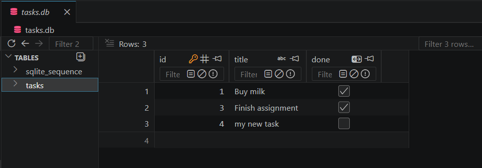

# tasks-sqlite

CRUD API for tasks, backed by SQLite (`node:sqlite`, built into Node — no
install needed) instead of an in-memory array. Same endpoints, same
request/response shapes — only the storage layer changed.

## Run it

```bash
node server.js
```

Creates `tasks.db` on first run, seeds 3 example tasks. Restarting the
server does not reset the data.

## Endpoints

| Method | Path             | Description                     |
|--------|------------------|----------------------------------|
| GET    | `/tasks`         | List all tasks                  |
| GET    | `/tasks?done=true`| Filter by completion            |
| GET    | `/tasks?search=milk`| Search titles                 |
| GET    | `/tasks/:id`     | Get one task (404 if missing)   |
| POST   | `/tasks`         | Create (400 if `title` missing) |
| PUT    | `/tasks/:id`     | Update (404 if missing)         |
| DELETE | `/tasks/:id`     | Delete (404 if missing)         |
| GET    | `/stats`         | `{ total, done, remaining }`    |

## Database

`tasks.db` lives in the project root, gitignored. Viewed here using VS
Code's SQLite Viewer extension:



## Persistence proof

Created/updated/deleted tasks via curl, confirmed with `GET /tasks`,
stopped the server, restarted it, ran `GET /tasks` again — same rows
returned, no re-seed message logged.

## Architecture

`server.js` (routes) only calls `db.prepare(sql).get/all/run()` — it
doesn't know or care that `db.js` is backed by SQLite. That's what let the
storage layer swap in without touching any endpoint.
