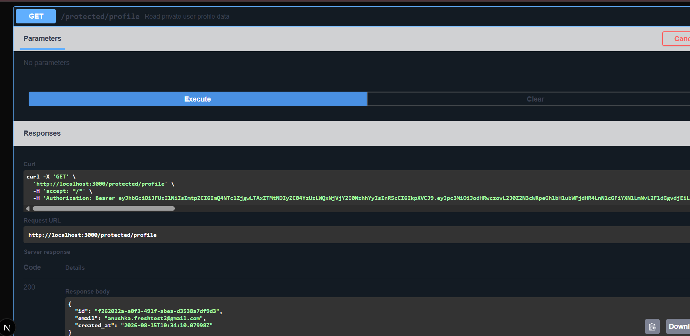

# task4-auth-protect

Secure API with sign up, log in, log out, and protected routes — built for
BE-03 (Week 4, Backend AI Engineering track). Uses Supabase as the Identity
Provider (handles password hashing and JWT issuance) and verifies those
JWTs on the backend to protect specific routes.

## What this is

Every earlier assignment in this repo had wide-open APIs. This one adds
real authentication: a client signs up or logs in through Supabase, gets
back a JWT (access token), and has to present that token on every request
to a protected route. The server verifies the token with Supabase before
letting the request through.

## Stack

- Next.js (App Router) — route handlers under `app/`
- `@supabase/supabase-js` — Identity Provider integration
- `swagger-ui-react` — interactive API docs at `/docs`
- Environment variables via `.env.local` (gitignored)

## Setup

1. Create a free project at [supabase.com](https://supabase.com)
2. Get your **Project URL** and **anon/publishable key** from
   Project Settings → API
3. Clone this repo, then inside `task4-auth-protect/`:
```bash
   npm install
```
4. Create `.env.local` in the project root:
SUPABASE_URL=your_project_url
SUPABASE_KEY=your_anon_key
PORT=3000

5. Run the server:
```bash
   npm run dev
```
   Server starts on `http://localhost:3000`.

**Note:** for local testing, email confirmation was turned off in Supabase
(Authentication → Sign In / Providers → Email → "Confirm email" toggle),
so newly signed-up test accounts can log in immediately without clicking a
confirmation email link.

## API Reference

| Method | Route                  | Auth required? | Description                          |
|--------|-------------------------|-----------------|----------------------------------------|
| POST   | `/auth/signup`          | No              | Create a new user account              |
| POST   | `/auth/login`           | No              | Authenticate and receive a JWT         |
| POST   | `/auth/logout`          | Yes             | Terminate the current session          |
| GET    | `/protected/profile`    | Yes             | Read the authenticated user's profile  |
| GET    | `/protected/dashboard`  | Yes             | Example second protected route         |
| GET    | `/public/info`          | No              | Public, unauthenticated data           |

Protected routes require an `Authorization: Bearer <token>` header. Missing
or invalid tokens return `401`.

## Status codes used

| Code | When                                             |
|------|--------------------------------------------------|
| 200  | Successful login / read                           |
| 201  | Account created                                   |
| 204  | Logout successful (no content)                    |
| 400  | Missing required fields (email/password)          |
| 401  | Missing, invalid, or expired token / bad login    |

## Swagger UI

Interactive docs are available at `http://localhost:3000/docs` once the
server is running. Click **Authorize**, paste an access token (obtained
from `/auth/login`), and protected routes can be tested directly from the
browser.



## Architecture

- `lib/supabaseClient.js` — initializes the Supabase client from env vars
- `lib/authMiddleware.js` — reusable `requireAuth()` function: extracts and
  verifies the bearer token, used by every protected route instead of
  duplicating that logic
- `app/auth/*/route.js` — signup, login, logout routes
- `app/protected/*/route.js` — routes that call `requireAuth()` first
- `app/public/info/route.js` — the one route with no auth check

## Testing this yourself

```bash
# sign up
curl -X POST http://localhost:3000/auth/signup \
  -H "Content-Type: application/json" \
  -d "{\"email\":\"you@example.com\", \"password\":\"yourpassword\"}"

# log in
curl -X POST http://localhost:3000/auth/login \
  -H "Content-Type: application/json" \
  -d "{\"email\":\"you@example.com\", \"password\":\"yourpassword\"}"

# use the access_token from the login response
curl http://localhost:3000/protected/profile \
  -H "Authorization: Bearer <access_token>"
```

A peer cloning this repo can plug in their own `.env.local` values (see
Setup above) and have the whole authenticated API running in under 5
minutes.